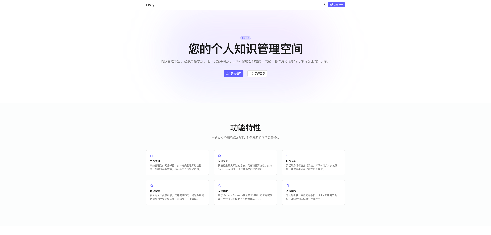
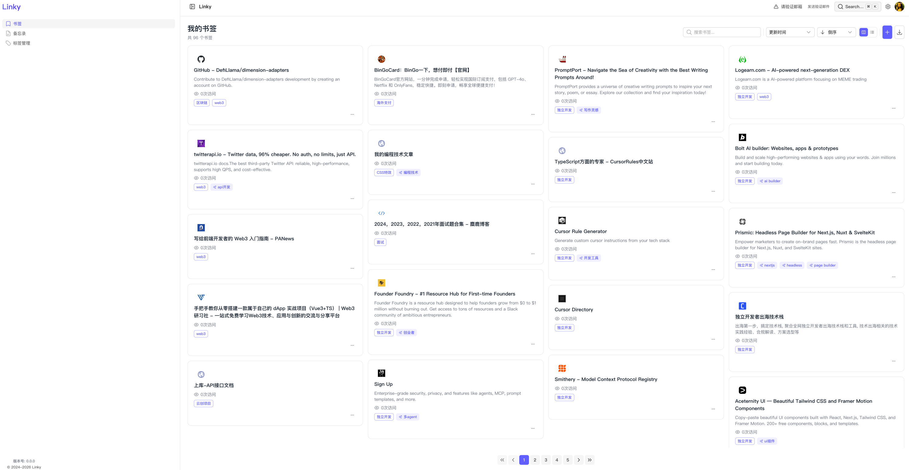
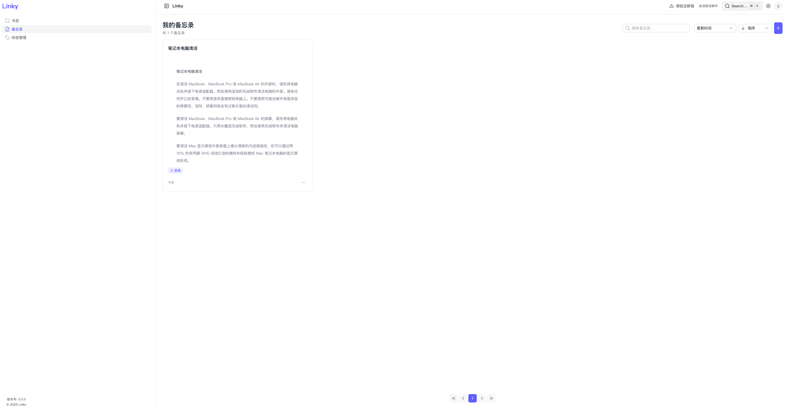
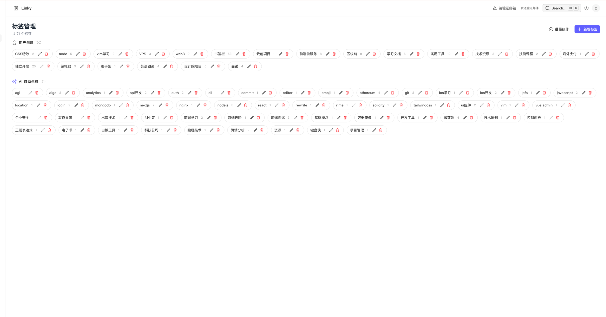

# Linky

Personal Knowledge Management System

**[English](README.md)** | [简体中文](README.zh-CN.md)

---

## What It Does

### Bookmarks
- Save URLs with auto-fetched title, description, and thumbnail
- Import from browser HTML exports
- Organize with tags
- 2 view modes: waterfall (masonry), list
- Track visit count

### Memos
- Write in Markdown
- Pin important ones
- Tag them too

### Tags
- Create colored tags
- View all items under a tag
- AI auto-tagging (triggers automatically when creating bookmarks)

### AI Integration
- Connect to OpenAI-compatible API (Ollama, Groq, etc.)
- AI can suggest tags when adding bookmarks
- **Note**: Frontend does not have a dedicated AI chat interface. Chat API is available at backend for custom integrations.

### Search
- Global search across bookmarks, memos, and tags
- Keyboard shortcut: Ctrl+K

### Auth
- Email + password login
- Token-based auth (stateless)
- Email verification
- Password reset
- Avatar upload/delete

---

## Screenshots

| Home | Workspace |
|------|-----------|
|  |  |

| Memos | Tags |
|-------|------|
|  |  |

---

## Deployment

### Requirements
- Node.js >= 20.0.0
- pnpm >= 10.26.1
- PostgreSQL
- PM2

### Quick Deploy

```bash
# 1. Clone repository
git clone https://github.com/zguiyang/Linky.git
cd Linky

# 2. Install dependencies
pnpm install

# 3. Copy and configure environment files
cp backend/.env.example backend/.env
cp web/.env.example web/.env

# Edit backend/.env with your PostgreSQL credentials and other settings

# 4. Run database migrations
cd backend
node ace migration:run
cd ..

# 5. Build both backend and frontend
pnpm run build

# 6. Start with PM2
pm2 start ecosystem.config.js
```

### Configuration

Edit `backend/.env`:
```env
# Database
PG_HOST=127.0.0.1
PG_PORT=5432
PG_USER=root
PG_PASSWORD=your_password
PG_DATABASE=linky

# App
PORT=3333
APP_URL=http://your-domain.com

# Frontend (web/.env)
NUXT_PUBLIC_API_BASE_URL=http://localhost:3333
```

### PM2 Commands

```bash
# Start
pm2 start ecosystem.config.js

# Restart
pm2 restart linky-backend
pm2 restart linky-web

# Stop
pm2 stop ecosystem.config.js

# View logs
pm2 logs

# Monitor
pm2 monit
```

---

## Quick Start (Development)

```bash
# Install dependencies
pnpm install

# Setup environment
cp backend/.env.example backend/.env
cp web/.env.example web/.env

# Run migrations
cd backend && node ace migration:run && cd ..

# Start development servers
pnpm run dev:backend   # Backend :3333
pnpm run dev:web       # Frontend :3000
```

Visit http://localhost:3000

---

## Project Structure

```
Linky/
├── backend/           # AdonisJS API
│   ├── app/
│   │   ├── controllers/
│   │   ├── models/
│   │   ├── services/
│   │   └── ...
│   └── database/migrations/

└── web/               # Nuxt frontend
    └── app/
        ├── pages/
        ├── components/
        └── ...
```

---

## License

Dual licensed:
- GPLv3 for open source
- Commercial license available

Contact: zhaoguiyang18@outlook.com

---

## Why I Built This

I wanted a simple, self-hosted tool to organize bookmarks and write notes. No complex features, no cloud dependency. Just something that works and keeps my data.

---

## Contact

Issues welcome: https://github.com/zguiyang/Linky/issues
