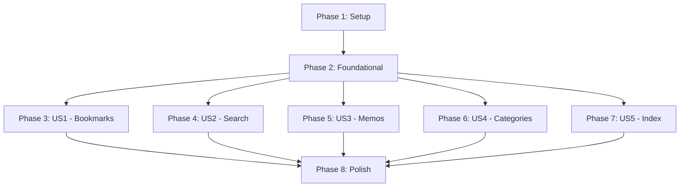

# Implementation Tasks: 书签备忘录管理工具高保真原型设计

**Feature Branch**: `001-bookmark-manager` | **Date**: 2025-12-13 | **Spec**: [spec.md](spec.md)
**Total Tasks**: 48
**Project Type**: Static HTML Prototype (No Build Tools)
**Target Directory**: `/prd`

## Overview

本任务清单基于最新的简化需求，专注于创建高保真HTML原型。所有任务都是关于创建独立的HTML文件，使用CDN资源，无需本地开发环境或构建工具。

### Key Constraints

- 仅HTML文件在 `/prd` 目录
- 使用 Tailwind CSS CDN
- 使用 FontAwesome CDN
- 使用真实图片（Unsplash/Pexels）
- 每个功能一个HTML文件
- 无需JavaScript框架或构建工具

---

## Phase 1: 项目初始化（Setup）

### 目标

准备好基础的项目结构和环境。

### 任务清单

- [ ] T001 创建 /prd 目录结构
- [ ] T002 准备CDN资源链接文档（Tailwind CSS 和 FontAwesome）
- [ ] T003 收集真实图片资源链接（Unsplash/Pexels）
- [ ] T004 创建通用HTML模板文件（包含导航栏结构）

---

## Phase 2: 基础框架（Foundational）

### 目标

创建所有页面共享的基础导航和样式框架。

### 任务清单

- [ ] T005 创建基础HTML模板（包含CDN链接、viewport设置）
- [ ] T006 设计统一的导航栏组件样式
- [ ] T007 定义响应式布局断点规范（sm:640px, md:768px, lg:1024px, xl:1280px）
- [ ] T008 在HTML中内嵌模拟数据脚本（书签、分类、标签、备忘录数据）

---

## Phase 3: User Story 1 - 书签收藏与分类管理界面 (P1) 🎯

### 目标

创建书签管理的核心界面原型，展示书签列表、添加/编辑表单、分类管理等功能布局。

### 独立测试标准

访问 bookmarks.html 页面，能够查看完整的书签管理界面设计，包括网格视图、侧边栏分类树、添加按钮等界面元素。

### 任务清单

- [ ] T009 [US1] 创建 bookmarks.html 页面基础结构
- [ ] T010 [US1] 实现书签列表网格布局（桌面端3列，平板端2列，移动端1列）
- [ ] T011 [US1] 创建侧边栏分类树组件界面
- [ ] T012 [US1] 设计书签卡片组件（包含缩略图、标题、标签、操作按钮）
- [ ] T013 [US1] 创建"添加书签"按钮和弹出表单界面
- [ ] T014 [US1] 添加书签编辑表单界面设计
- [ ] T015 [US1] 实现分类管理界面（添加、编辑、删除分类的UI）
- [ ] T016 [US1] 添加书签快速搜索和标签筛选功能界面
- [ ] T017 [US1] 优化移动端响应式布局（抽屉式侧边栏）

---

## Phase 4: User Story 2 - 搜索与过滤界面 (P1)

### 目标

设计搜索和过滤功能的界面原型，展示搜索框、高级筛选器、标签云等界面元素。

### 独立测试标准

访问 search.html 页面，能够查看完整的搜索和过滤界面设计。

### 任务清单

- [ ] T018 [US2] 创建 search.html 页面基础结构
- [ ] T019 [US2] 设计搜索输入框和搜索建议下拉界面
- [ ] T020 [US2] 创建高级筛选器界面（标签选择、分类筛选、日期范围）
- [ ] T021 [US2] 实现标签云可视化展示界面
- [ ] T022 [US2] 设计搜索结果列表展示布局
- [ ] T023 [US2] 添加搜索历史功能界面
- [ ] T024 [US2] 创建无搜索结果的友好提示界面

---

## Phase 5: User Story 3 - 备忘录管理界面 (P2)

### 目标

设计备忘录管理功能的界面原型，展示富文本编辑器、备忘录列表、与书签关联的界面设计。

### 独立测试标准

访问 memos.html 页面，能够查看完整的备忘录管理界面设计。

### 任务清单

- [ ] T025 [US3] 创建 memos.html 页面基础结构
- [ ] T026 [US3] 设计备忘录列表卡片布局
- [ ] T027 [US3] 创建富文本编辑器界面（工具栏、编辑区）
- [ ] T028 [US3] 实现备忘录与书签关联展示界面
- [ ] T029 [US3] 添加备忘录搜索和分类功能界面
- [ ] T030 [US3] 创建备忘录置顶和收藏功能界面

---

## Phase 6: User Story 4 - 分类管理界面 (P1)

### 目标

创建专门的分类管理界面，展示分类树的层级结构和操作界面。

### 独立测试标准

访问 categories.html 页面，能够查看完整的分类管理界面设计。

### 任务清单

- [ ] T031 [US4] 创建 categories.html 页面基础结构
- [ ] T032 [US4] 实现分类树层级展示界面
- [ ] T033 [US4] 设计分类添加、编辑、删除操作界面
- [ ] T034 [US4] 添加分类统计信息展示界面
- [ ] T035 [US4] 创建分类颜色选择器界面
- [ ] T036 [US4] 实现分类拖拽排序功能界面

---

## Phase 7: User Story 5 - 主导航页面 (P3)

### 目标

创建主导航页面，提供所有界面原型的导航链接。

### 独立测试标准

访问 index.html 页面，能够看到所有界面原型的导航链接。

### 任务清单

- [ ] T037 [US5] 创建 index.html 主导航页面
- [ ] T038 [US5] 设计功能介绍卡片布局
- [ ] T039 [US5] 添加项目概述和使用说明
- [ ] T040 [US5] 创建快速导航链接和搜索功能

---

## Phase 8: 优化和完善（Polish）

### 目标

统一视觉风格，优化性能，完善交互效果。

### 任务清单

- [ ] T041 统一所有页面的视觉风格（配色方案、字体、间距）
- [ ] T042 添加 hover 效果和过渡动画（按钮、卡片、链接）
- [ ] T043 优化图片加载（添加loading="lazy"、合适的尺寸）
- [ ] T044 完善移动端适配和触摸优化
- [ ] T045 添加加载状态和空状态设计
- [ ] T046 检查所有页面的导航链接正确性
- [ ] T047 使用浏览器开发者工具测量页面加载时间
- [ ] T048 优化图片和资源加载性能（压缩、CDN、缓存策略）
- [ ] T049 优化可访问性（语义化HTML、ARIA标签、键盘导航）
- [ ] T050 添加页面标题和meta描述
- [ ] T051 创建README文档说明如何使用原型
- [ ] T052 设计重复书签URL提示界面（覆盖确认对话框）
- [ ] T053 设计分类删除确认界面（选择移动或一起删除书签）
- [ ] T054 设计空搜索结果友好提示界面
- [ ] T055 设计网络断开状态提示界面（显示已加载内容）

---

## Dependencies



## Parallel Execution Opportunities

### Phase 3-7 可以并行执行

一旦 Phase 2 完成后，各个用户故事的界面可以独立开发：

```bash
# 开发者A - 书签管理界面
- T009-T017: 创建完整的书签管理界面

# 开发者B - 搜索界面
- T018-T024: 创建搜索和过滤界面

# 开发者C - 备忘录界面
- T025-T030: 创建备忘录管理界面

# 开发者D - 分类界面
- T031-T036: 创建分类管理界面

# 开发者E - 主导航页面
- T037-T040: 创建主导航和介绍页面
```

## Independent Test Criteria by User Story

| User Story       | Test Criteria                                           | 验证方法                           |
| ---------------- | ------------------------------------------------------- | ---------------------------------- |
| US1 (Bookmarks)  | bookmarks.html 完整加载，展示书签列表、侧边栏、添加按钮 | 在浏览器打开文件，检查所有UI元素   |
| US2 (Search)     | search.html 完整加载，展示搜索框、筛选器、标签云        | 在浏览器打开文件，检查搜索功能界面 |
| US3 (Memos)      | memos.html 完整加载，展示备忘录列表、编辑器界面         | 在浏览器打开文件，检查备忘录功能   |
| US4 (Categories) | categories.html 完整加载，展示分类树和管理界面          | 在浏览器打开文件，检查分类管理     |
| US5 (Index)      | index.html 完整加载，展示所有页面的导航链接             | 在浏览器打开文件，点击所有链接     |

## MVP Scope

**最小可行产品**（建议优先完成）：

- Phase 1-2 (基础框架)
- Phase 3: US1 (书签管理界面) - T009-T017
- Phase 7: US5 (主导航页面) - T037-T040
- Phase 8 的基础优化 - T041-T046

## Implementation Strategy

1. **MVP First**: 先完成核心的书签管理界面和导航
2. **Incremental**: 每个用户故事独立完整，可单独演示
3. **Design Consistency**: 使用统一的设计系统和组件样式
4. **Performance**: 优先加载首屏内容，图片使用懒加载
5. **Accessibility**: 确保语义化HTML和键盘导航支持

## Quick Start Commands

```bash
# 1. 检查先决条件
ls -la /prd  # 确保目录存在

# 2. 开始开发
# 创建第一个HTML文件
touch /prd/index.html

# 3. 验证部署
# 用浏览器打开
open /prd/index.html

# 或使用本地服务器
python -m http.server 8000 --directory /prd
# 然后访问 http://localhost:8000
```

## Success Metrics

- ✅ 5个HTML文件在 /prd 目录创建完成
- ✅ 页面加载时间 < 2秒（本地文件）
- ✅ 响应式设计在 320px-1920px 范围内正常显示
- ✅ 使用真实图片，无占位符
- ✅ 统一的设计风格（简约、圆角、卡片式）
- ✅ 所有导航链接正常工作
- ✅ 通过可访问性基本检查

## File Structure After Completion

```
prd/
├── index.html          # 主导航页面
├── bookmarks.html      # 书签管理页面
├── search.html         # 搜索功能页面
├── memos.html          # 备忘录管理页面
├── categories.html     # 分类管理页面
└── README.md          # 使用说明文档
```

## Note for Developers

- 所有页面必须使用相同的HTML头部结构
- 图片必须使用真实的Unsplash/Pexels链接
- 保持代码简洁，添加必要的注释
- 每个页面应该是独立的，可以直接在浏览器中打开
- 使用语义化的HTML5标签
- 确保在没有网络连接时（除了CDN）页面基本功能可见
